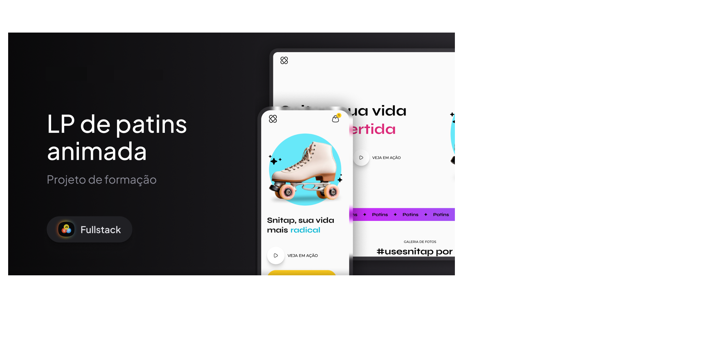

# LP de Patins Animada

Animação e interatividade aplicadas em uma landing page visualmente envolvente e moderna, inspirada no design do Figma proposto durante o curso.

## 📸 Preview

 <!-- ou usar link externo, se preferir -->

## 🚀 Funcionalidades

- Layout responsivo (desktop e mobile)
- Animações com `@keyframes` e transições suaves
- Troca de textos animada com efeito de `slideUp`
- Entrada animada dos elementos principais
- Botões com efeitos de hover
- Design 100% fiel ao Figma

## 🧰 Tecnologias utilizadas

- HTML5 semântico
- CSS3 com variáveis, `flexbox` e `@keyframes`
- Animações personalizadas com `transform`, `transition`, `animation`
- Media queries para responsividade manual

## 🧠 Aprendizado

Este projeto foi desenvolvido como parte do módulo de animações do curso de Desenvolvimento Web. A proposta principal foi aplicar efeitos visuais impactantes usando apenas HTML e CSS, sem JavaScript.

Como desafio adicional, implementei toda a responsividade, o que exigiu ajustes em variáveis, tamanhos de fonte e valores de animação para garantir consistência visual em diferentes tamanhos de tela.

## 🌐 Deploy

🔗 [Acesse o projeto publicado aqui](https://devwebfelipe.github.io/LPdePatinsAnimada)

## 💡 Melhorias futuras

- Implementar rotação automática de slides com JavaScript
- Adicionar testes de acessibilidade e contraste
- Expandir para outras seções do site com o mesmo padrão visual

## 👨‍💻 Autor

Desenvolvido por **Felipe Teixeira**  
🔗 [Portfólio](https://devwebfelipe.github.io/PortifolioDev)  
🔗 [GitHub](https://github.com/DevWebFelipe)
